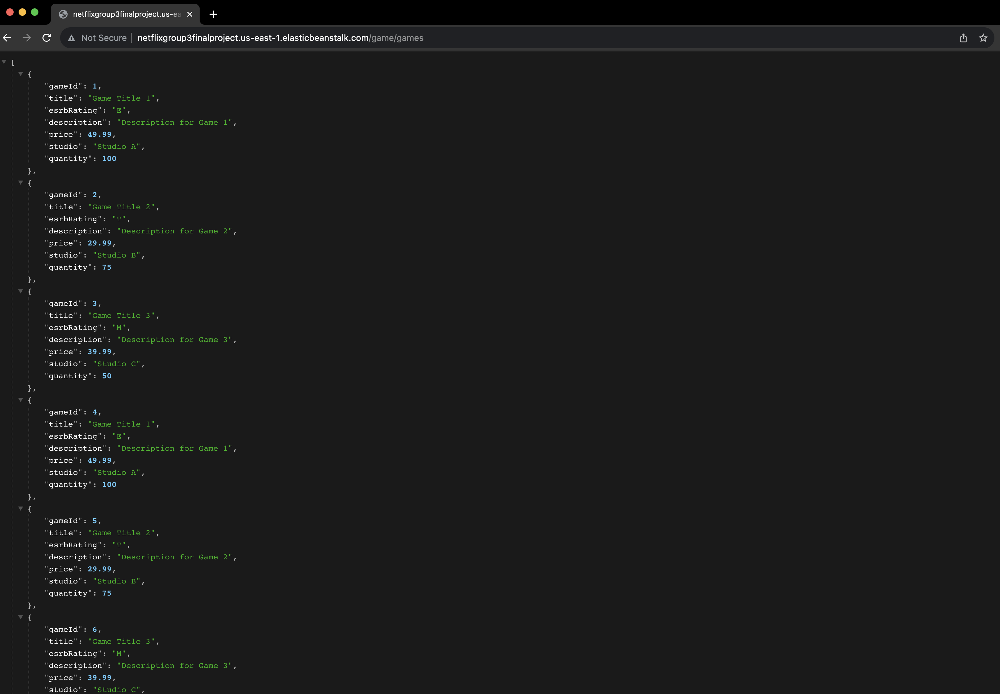

# Netflix_Group3_Final_Project

## Project Overview

This is a group final project designed to build a full-stack application for managing the inventory of a video game store. The back-end API supports CRUD (Create, Read, Update, Delete) operations for video games, game consoles, and T-shirts. The project was built with Spring Boot, Spring MVC, and Java 11.

**AWS Deployment Endpoint:** [http://netflixgroup3finalproject.us-east-1.elasticbeanstalk.com/](http://netflixgroup3finalproject.us-east-1.elasticbeanstalk.com/)

## Features

- **RESTful API**: Supports CRUD operations for video games, consoles, and T-shirts, as well as specialized search functionalities.
- **GraphQL API**: Supports specialized queries for games and consoles.
- **Invoice Generation**: Allows users to purchase items while automatically calculating taxes and processing fees.
- **Exception Handling**: Comprehensive exception handling and validation are implemented.

## Prerequisites

- Java 11
- Maven
- Spring Boot 2.x.x
- AWS Elastic Beanstalk
- Amazon RDS

## Screenshot of Functional AWS Endpoint

